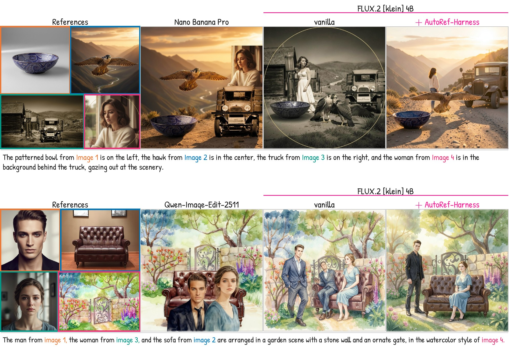
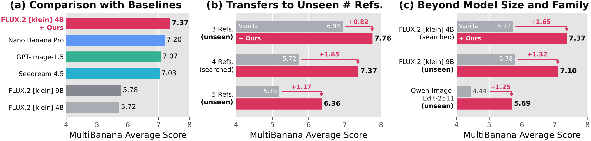
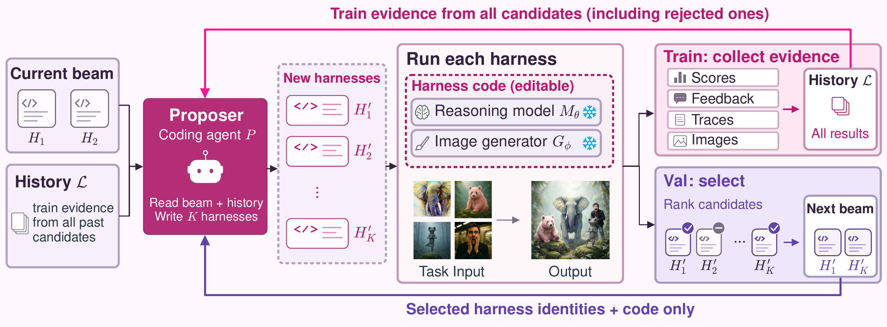

<div align="center">

# AutoRef: Harness Optimization for Agentic Multi-Reference Image Generation

<b>Yuta Oshima*, Ku Onoda*, Yusuke Iwasawa, Masahiro Suzuki, Yutaka Matsuo, Hiroki Furuta</b><br>
(*equal contribution)

 <a href="https://arxiv.org/abs/2609.35530">
   
 </a>
 <a href="https://opensource.org/licenses/MIT">
  
</a>

</div>

<details open><summary>💡 We also have other multi-reference image generation projects that may interest you ✨</summary><p>

> [**MultiBanana: A Challenging Benchmark for Multi-Reference Text-to-Image Generation**](https://arxiv.org/abs/2511.22989) <br>
> **🍌 CVPR 2026 (Main) 🍌** <br>
> Yuta Oshima, Daiki Miyake, Kohsei Matsutani, Yusuke Iwasawa, Masahiro Suzuki, Yutaka Matsuo, Hiroki Furuta <br>
> [](https://cvpr.thecvf.com/)
> [](https://github.com/matsuolab/multibanana)
> [](https://github.com/matsuolab/multibanana)
> [](https://arxiv.org/abs/2511.22989) <br>

</p></details>

## 🌏 Overview





**Multi-reference image generation** composes several reference images (people, objects,
backgrounds, styles) into one image that follows an instruction, such as *"the patterned bowl from
image 1 on the left, the hawk from image 2 in the center, the truck from image 3 on the right"*.
Image generators often drop, duplicate or misplace a reference, or paste it in without blending it
into the scene.

**AutoRef** improves a generator without training it. It optimizes the **harness**: the program
around a frozen image generator and a frozen reasoning model that decides what to ask, what to draw
and which image to return. A coding agent writes harnesses as code, and a beam search keeps the
ones that hold up on tasks the agent never sees.

The harness AutoRef discovered, **AutoRef-Harness**, raises FLUX.2 [klein] 4B from 5.72 to **7.37**
on held-out MultiBanana tasks, above Nano Banana Pro (7.20) and GPT-Image-1.5 (7.07). It transfers
unchanged to unseen reference counts and to other generators, FLUX.2 [klein] 9B and
Qwen-Image-Edit-2511.

## 🧩 AutoRef-Harness

AutoRef-Harness ([`harnesses/autoref_harness.py`](harnesses/autoref_harness.py)) draws three images
per task, with a reasoning model (GPT-5.5) around the generator:

1. **Reference-grounded prompting.** The instruction is rewritten into a prompt that fixes one setting,
   light and medium, and names every subject "from image N" with a few identity words, its place and
   what it stands on.
2. **Structurally diverse drafts.** Draft A comes from that prompt. For draft B, the reference
   that sets the background (or the style) is passed to the generator first, as the picture to keep
   (or the style to paint in), and the other subjects are placed into it.
3. **Failure-aware selection.** A strict check for missing, extra or duplicated subjects and a wrong
   background decides first. Ties go to a pairwise comparison asked in both presentation orders, and
   the challenger wins only if both orders pick it.
4. **Complaint-directed revision.** Concrete complaints about the winner, each naming the reference
   it concerns, are folded into a revised prompt for draft C, which must beat the winner by the same
   rule.

### 🛠️ Setup

Python 3.10+ and a CUDA GPU with 48 GB.

```bash
git clone https://github.com/KuOnoda/AutoRef.git && cd AutoRef
python -m venv .venv && source .venv/bin/activate
pip install -e .
export OPENAI_API_KEY=...          # GPT-5.5, the reasoning model
```

### 🚀　Quick start

```bash
python -m autoref.generate --refs dog.png hat.png beach.png \
    --prompt "The dog from image 1 wears the hat from image 2 and sits on the beach from image 3." \
    --out out.png
```

`--generator` selects `flux-klein-4b` (default), `flux-klein-9b` or `qwen-image-edit-2511`. The three
drafts are kept in `out_rounds/`.

### 📊　Evaluate on MultiBanana

```bash
bash scripts/setup_data.sh                                       # MultiBanana, the judge's prompt and GEMS -> external/
python -m autoref.multibanana --split test                       # 133 held-out tasks, FLUX.2 [klein] 4B
python -m autoref.multibanana --split test --generator flux-klein-9b
python -m autoref.multibanana --split test --generator qwen-image-edit-2511
```

Each output is scored by the benchmark's official judge (Qwen3-VL-8B, five criteria on a 1-10
scale) and the mean is printed; the images, a trace of every model call and the judge's answers are
written to `outputs/runs/multibanana/`. `--split ref3` and `--split ref5` evaluate three and five
references.

FLUX.2 [klein] 9B is gated on Hugging Face: accept its license and set `HF_TOKEN`.
Qwen-Image-Edit-2511 needs about 58 GB: on a 48 GB card set `AUTOREF_CPU_OFFLOAD=1`, or spread it over
three cards with `AUTOREF_SHARD_GPUS=3`.

## 🤖 AutoRef



At each iteration, a coding agent (Claude Code) reads the search history and writes K = 4 new
harnesses as code. Each candidate runs on training tasks, and its scores, the judge's rationales,
execution traces and images join the history. Validation tasks, which the agent never sees, rank the
candidates, and the best B = 2 become the beam the next iteration builds on; the agent learns only
which candidates survived. Starting from the generator alone and GEMS, five iterations produced
AutoRef-Harness.

### 🔍 Run the search

In addition to the setup above: the Claude Code CLI (native installer) logged in to a Claude
subscription, Docker with GPU support, and `OPENAI_API_KEY` in a `.env` file at the repository root
(copy `.env.example`). The agent's container reads the key from `.env`, not from your shell, and can
read every key in that file, so keep only this one there.

```bash
docker build -t autoref-proposer:latest sandbox/               # the agent's container
python -m autoref.search --run-name my_search                  # T = 5, B = 2, K = 4 on 48 + 48 tasks
python -m autoref.search --run-name my_search --finalize       # evaluate the final harness on the test split
```

The agent runs in a container that sees only the training tasks, the harness interface and the
run's history; validation and test results stay outside ([`sandbox/`](sandbox/)). Candidates and
logs are written to `outputs/search/<run-name>/`, and an interrupted search resumes where it stopped.
In the paper's search, each agent session took about 1.5 hours and each evaluation on 48 tasks about
an hour.

Other coding agents can act as the proposer with `--proposer manual`, which prints each iteration's
prompt and waits for `pending_eval.json`; only Claude Code was used in the paper.

## ⭐️ Citation

```bibtex
@misc{oshima2026autoref,
      title={AutoRef: Harness Optimization for Agentic Multi-Reference Image Generation}, 
      author={Yuta Oshima and Ku Onoda and Yusuke Iwasawa and Masahiro Suzuki and Yutaka Matsuo and Hiroki Furuta},
      year={2026},
      eprint={2609.35530},
      archivePrefix={arXiv},
      primaryClass={cs.CV},
      url={https://arxiv.org/abs/2609.35530}, 
}

@inproceedings{oshima2026multibanana,
    author    = {Oshima, Yuta and Miyake, Daiki and Matsutani, Kohsei and Iwasawa, Yusuke and Suzuki, Masahiro and Matsuo, Yutaka and Furuta, Hiroki},
    title     = {MultiBanana: A Challenging Benchmark for Multi-Reference Text-to-Image Generation},
    booktitle = {Proceedings of the IEEE/CVF Conference on Computer Vision and Pattern Recognition (CVPR)},
    month     = {June},
    year      = {2026},
    pages     = {448-460}
}
```

## 🙏 Acknowledgements

The search loop, the agent's instructions and [`autoref/search/claude_wrapper.py`](autoref/search/claude_wrapper.py)
are adapted from [Meta-Harness](https://github.com/stanford-iris-lab/meta-harness). The search starts
from [GEMS](https://github.com/lcqysl/GEMS), whose prompts are read from its repository at run time.
We evaluate on [MultiBanana](https://github.com/matsuolab/multibanana); the reference images in the
figures are from it. See [THIRD_PARTY_NOTICES.md](THIRD_PARTY_NOTICES.md) for licenses.
